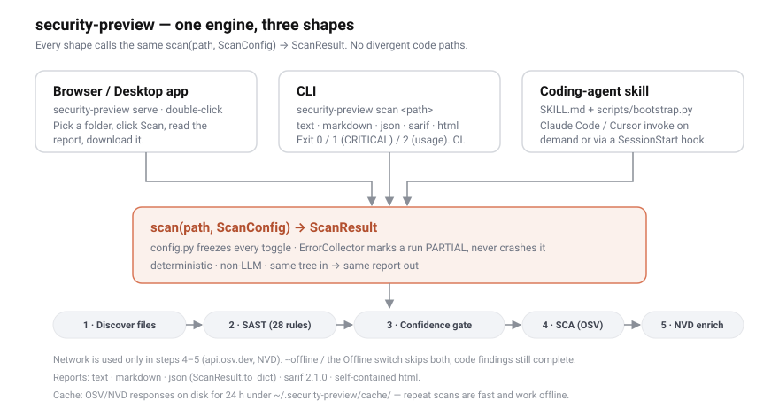
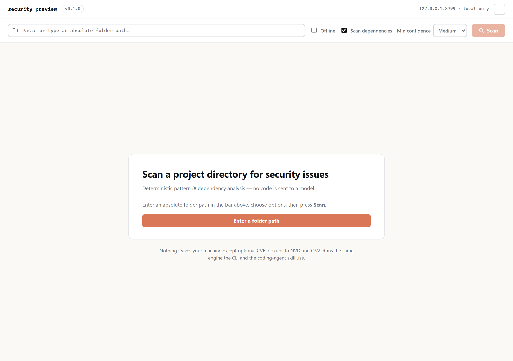
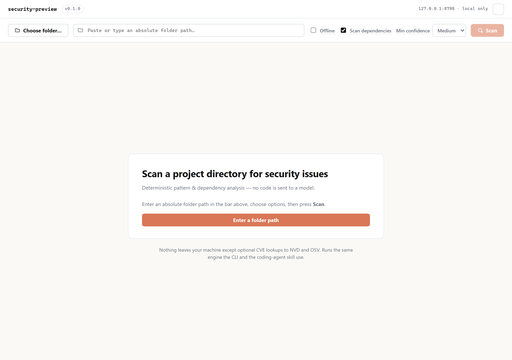
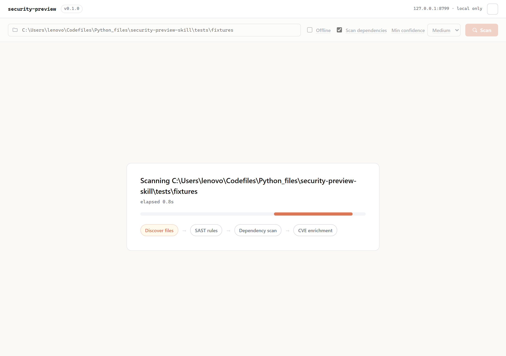
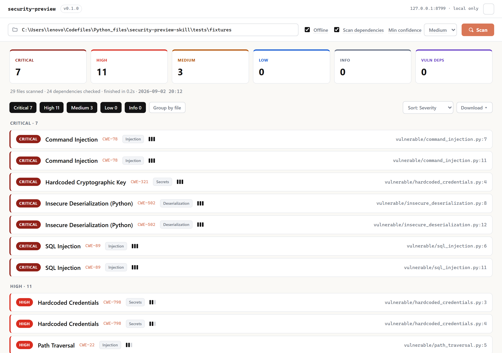
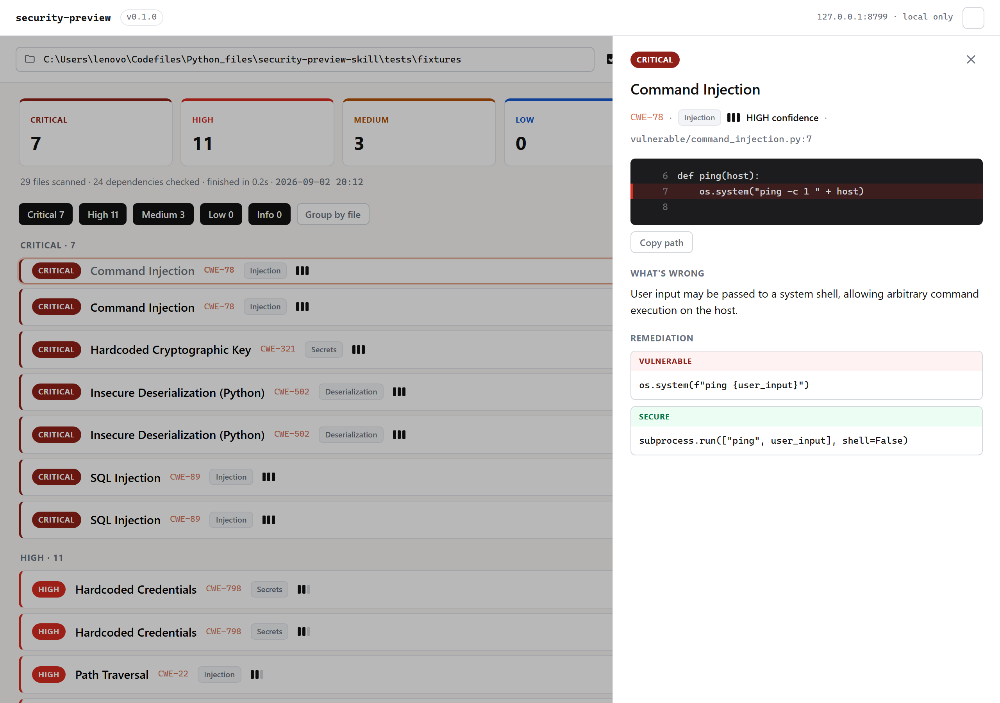
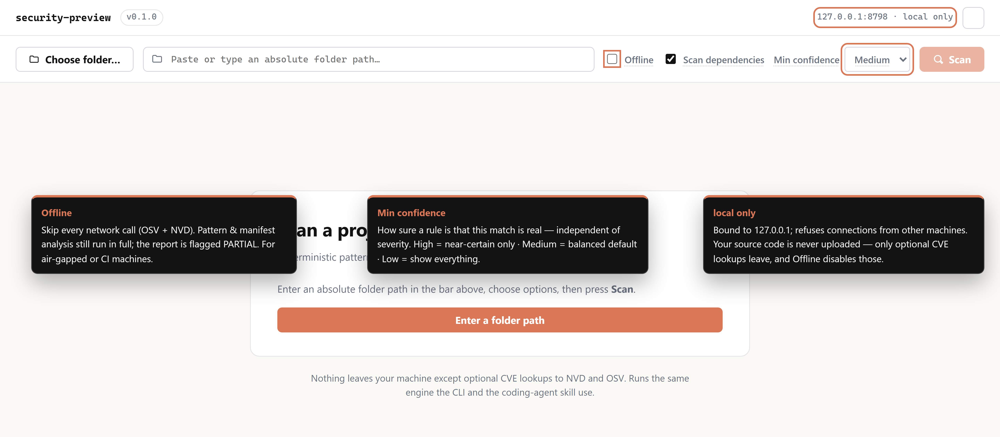

# security-preview

`security-preview` is a **deterministic, non-LLM** static security scanner for a
local project directory. It runs regex + AST pattern rules (SAST) and real
dependency CVE matching (SCA, via `api.osv.dev`), then produces a vulnerability
report with per-finding remediation. Nothing about the analysis is model-driven,
so the same tree always yields the same report.

It ships in **three shapes over one shared engine**:

| Version | Entry point | Who uses it | More |
|---|---|---|---|
| **1 · Browser / Desktop app** | `security-preview serve` · or the double-click installer | A person who wants to point at a folder and read a rendered report | [below](#1--browser--desktop-app), [`docs/DESKTOP.md`](docs/DESKTOP.md) |
| **2 · CLI** | `security-preview scan <path>` | A terminal user; also what CI calls | [below](#2--cli), [`docs/USAGE.md`](docs/USAGE.md) |
| **3 · Coding-agent skill** | [`SKILL.md`](SKILL.md) + `scripts/bootstrap.py` | Claude Code / Cursor, on demand or via a `SessionStart` hook | [below](#3--coding-agent-skill) |

All three call the same `scan(path, ScanConfig) -> ScanResult`. There are no
divergent code paths.



---

## The shared engine

Everything below is identical across all three versions.

- **28 SAST rules** — SQL/command/LDAP injection, XSS, path traversal, XXE,
  prototype pollution, hardcoded credentials & crypto keys, weak hashing/crypto,
  insecure deserialization (Python/Java/JS), JWT-without-verify, SSRF, CORS
  wildcard, debug mode, open redirect, mass assignment, sensitive data in logs,
  ReDoS, and more. Each finding keeps its CWE id and a
  `remediation_vulnerable` / `remediation_secure` code pair.
- **Real SCA** — lockfile parsers for `requirements.txt`, `poetry.lock`,
  `Pipfile.lock`, `package-lock.json`, `yarn.lock`, `go.mod`, `Gemfile.lock`,
  `pom.xml` → matched against the OSV known-vulnerability database (OSV/GHSA/CVE
  ids, fixed version, severity). Reported in a **separate** section from the
  pattern findings.
- **`ScanConfig`** (`config.py`) freezes every toggle — `offline`, `run_sca`,
  `enrich_nvd`, `min_confidence`, file/size caps, timeouts — so no code path can
  silently ignore one.
- **`ErrorCollector`** — every network / TLS / parse failure is appended as a
  structured `{stage, target, message}` entry and marks the result `partial`.
  A partial scan is still a valid scan; the code findings are complete.
- **Offline** — `--offline` (CLI) or the **Offline** switch (app) skips *all*
  network (OSV + NVD). SAST still completes.
- **Disk cache** — OSV/NVD responses are cached for 24 h under
  `~/.security-preview/cache/`. Repeat scans are fast and work from cache offline.
- **Reports** — `text`, `markdown` (GFM), `json` (`ScanResult.to_dict()`),
  `sarif` (2.1.0), `html` (one self-contained file, no scripts/web fonts).
- **Secrets are masked** (`sk_live_••••…`) before they ever reach a report.

The scan pipeline, in fixed order: **discover files → SAST rules → confidence
gate → dependency scan (OSV) → NVD enrichment**.

---

## 1 · Browser / Desktop app

The packaged desktop app is called **Vulnascan** — the same engine with a
double-click installer and app icon. Start it with `security-preview serve`
(opens your browser), `security-preview serve --desktop` / `vulnascan-desktop`
(native window), or the installer. The UI ships zero external resources and binds
`127.0.0.1` only.

### Empty state

Paste or type an absolute folder path, choose options, press **Scan**. The
**Scan** button stays disabled until a path is entered.



### Desktop mode — native folder picker

Launched with `--desktop` (or the installed app), a **Choose folder…** button
appears and opens the real OS directory dialog. The folder you pick *is* the root
for that scan — there is no global allowed root, and `..` / symlink escapes in a
typed path are still rejected with HTTP 400.



### Scanning

A progress view names the four stages (Discover files → SAST rules → Dependency
scan → CVE enrichment) with a running elapsed timer. Closing the window cancels a
scan in progress cleanly.



### Results

Severity tiles (CRITICAL / HIGH / MEDIUM / LOW / INFO + Vuln deps), a
files/dependencies/duration line, then findings grouped by severity. Toggle
severity chips to filter, **Group by file**, re-sort by severity / confidence /
file, and **Download ▾** the report (`.json` in-app; `.md` / `.sarif` / `.html`
via the CLI). A partial scan shows an amber **PARTIAL** banner above the tiles.



### Finding detail

Click any row for the detail drawer: the masked code snippet with the offending
line highlighted, **Copy path**, "What's wrong", the **Vulnerable → Secure**
remediation pair, and any illustrative CVEs for the same CWE (a link, not a claim
about your code).



### Scan-bar options and their tooltips

Every control in the scan bar has hover help. The three that most affect what a
scan does and where data goes:



| Control | Tooltip |
|---|---|
| **Offline** | Skip every network call (OSV dependency lookups and NVD CVE examples). Pattern and dependency-manifest analysis still run in full; the report is marked PARTIAL to flag the skipped enrichment. Use on air-gapped or CI machines. |
| **Scan dependencies** | Also parse lockfiles (`requirements.txt`, `package-lock.json`, `go.mod`, `pom.xml`, …) and match every dependency against the OSV known-vulnerability database. Turn off to run pattern rules only. |
| **Min confidence** | Hide findings whose confidence is below this level. Confidence is how sure a rule is that this specific match is real — it is independent of severity. High = only near-certain matches; Medium = the balanced default; Low = show everything, including weak or heuristic matches. |
| **`127.0.0.1 · local only`** (top-right badge) | This app is bound to 127.0.0.1 and refuses connections from any other machine. Your source code is read on this computer and never uploaded. The only traffic that can leave is optional CVE lookups to OSV and NVD — and the Offline switch disables those too. |

The packaged double-click app (installers, no Python) is covered in
[`docs/DESKTOP.md`](docs/DESKTOP.md).

---

## 2 · CLI

```
security-preview scan <path> [--format text|markdown|json|sarif|html]
                             [--offline] [--no-sca]
                             [--min-confidence low|medium|high] [--out FILE]
```

```console
$ security-preview scan --help
usage: security-preview scan [-h] [--format FORMAT] [--offline] [--no-sca]
                             [--min-confidence {low,medium,high}] [--out OUT]
                             path

  --format FORMAT       report format: text | markdown | json | sarif | html
  --offline             skip all network access (NVD + OSV)
  --no-sca              skip dependency (SCA) scanning
  --min-confidence {low,medium,high}
                        drop findings below this confidence (default: medium)
  --out OUT             write the report to this file instead of stdout
```

`--min-confidence` is case-insensitive; `HIGH` and `high` are equivalent.

**Exit codes:** `0` — completed, no CRITICAL findings · `1` — completed with ≥1
CRITICAL finding (the report is still emitted) · `2` — usage / IO error (bad
path, bad `--format`, unwritable `--out`). Network / enrichment failure never
changes the exit code; it only marks the report **PARTIAL**.

### Text report (default)

```console
$ security-preview scan ./service --offline --min-confidence high
security-preview report v0.1.0
target:  ./service
scanned: 2026-09-02 20:20 UTC | 0.0s | deterministic, non-LLM

SUMMARY
  CRITICAL  7
  HIGH      2
  MEDIUM    2
  LOW       0
  INFO      0
  DEPS      0  (vulnerable dependencies)
  files scanned: 13 | dependencies checked: 0

CODE FINDINGS (11)

CRITICAL
  [sast.command-injection] Command Injection
    location:   command_injection.py:7
    cwe:        CWE-78 (https://cwe.mitre.org/data/definitions/78.html)
    category:   Injection
    confidence: HIGH
    snippet:
           | def ping(host):
           |     os.system("ping -c 1 " + host)
    what's wrong: User input may be passed to a system shell, allowing arbitrary
                  command execution on the host.
    vulnerable:   os.system(f"ping {user_input}")
    secure:       subprocess.run(["ping", user_input], shell=False)
```

### Markdown report (`--format markdown`)

```markdown
# security-preview report

## Summary

| Severity | Count |
| --- | --- |
| 🔴 CRITICAL | 7 |
| 🟠 HIGH | 2 |
| 🟡 MEDIUM | 2 |
| 🔵 LOW | 0 |
| ⚪ INFO | 0 |
| Vulnerable dependencies | 0 |

### 🔴 CRITICAL — Command Injection — command_injection.py:7
...
```

### Vulnerable dependencies (online, `--format text` excerpt)

```console
VULNERABLE DEPENDENCIES
  MEDIUM    requests 2.25.1 (PyPI)
    advisories: CVE-2023-32681, CVE-2024-35195, CVE-2024-47081, GHSA-9wx4-h78v-vm56, PYSEC-2023-74, …
    fixed in:   2.31.0
    source:     manifests/pip/requirements.txt
    summary:    Requests vulnerable to .netrc credentials leak via malicious URLs
  LOW       @babel/core 7.12.3 (npm)
    advisories: CVE-2026-49356, GHSA-4x5r-pxfx-6jf8
    fixed in:   7.29.6
    source:     manifests/npm/package-lock.json
```

### `security-preview serve` and `security-preview selftest`

```console
$ security-preview serve --no-open
security-preview listening on http://127.0.0.1:52731  (Ctrl+C to stop)

$ security-preview selftest        # scans bundled fixtures, asserts the schema
{
  "by_severity": { "CRITICAL": 7, "HIGH": 11, "MEDIUM": 3, "LOW": 0, "INFO": 0 },
  "files_scanned": 13,
  "partial": false,
  "total_findings": 21
}
```

### CI / commit gate

`.claude/hooks-example.json` ships a `SessionStart` scan and a `PreToolUse` guard
that blocks `git commit` when the CRITICAL count rises above
`.security-preview/baseline-critical`. Plain (non-Claude) CI does the same by
parsing `--format json`. See
[`docs/USAGE.md`](docs/USAGE.md#ci--commit-gate). For air-gapped runners add
`--offline`.

---

## 3 · Coding-agent skill

The skill is [`SKILL.md`](SKILL.md) at the repo root plus `scripts/bootstrap.py`.
Claude Code (or Cursor) invokes it whenever the user asks for a "security
review", "vuln check", "scan my dependencies for CVEs", or a pre-ship safety pass
on a directory.

**Flow:**

1. If the `security-preview` console script is not importable, the agent runs
   `python scripts/bootstrap.py` once — it builds an isolated virtualenv
   (`uv` when present, else `python -m venv`) and installs the package.
2. The agent runs
   `security-preview scan "<project-dir>" --format json --min-confidence medium`
   and parses the JSON (`ScanResult.to_dict()` — the machine contract).
3. It presents back: the `summary.by_severity` table + `files_scanned` /
   `dependencies_scanned`; the top CRITICAL/HIGH findings with `file_path:line`,
   the masked `code_snippet`, and `remediation_secure`; any vulnerable
   dependencies (package, advisory ids, `fixed_version`); and — if `partial` is
   true — a warning listing `errors`.
4. It offers to write the full human report into the project
   (`--format markdown --out SECURITY_REPORT.md` or `--format html`).

It is **not** for remote-URL scanning, dynamic analysis, or secret rotation — it
only reads files on disk. Editor integration for Cursor and similar is covered in
[`docs/CURSOR.md`](docs/CURSOR.md).

---

## Develop

```bash
python -m venv .venv && . .venv/Scripts/activate    # Windows
pip install -e ".[dev]"
pytest -q
ruff check . && mypy src
```

- **Build plan:** `security-preview-plan.md`
- **UI & report design:** `security-preview-design-brief.md` + the design canvas
- **Parallel foundation build:** `security-preview-parallel-build-plan.md`
- **Desktop packaging:** `security-preview-desktop-packaging-plan.md`
- **Test plan:** `security-preview-test-plan.md`

### Regenerating the screenshots

The images under `docs/images/` are captured from a live `security-preview serve`
against `tests/fixtures/` with the Offline switch on (fast, deterministic, no
network). `architecture.svg` is hand-authored. The tooltip callouts in
`app-tooltips.png` are annotations drawn over the real UI; the copy in them is
verbatim from the `title` attributes in `server/static/index.html`.
